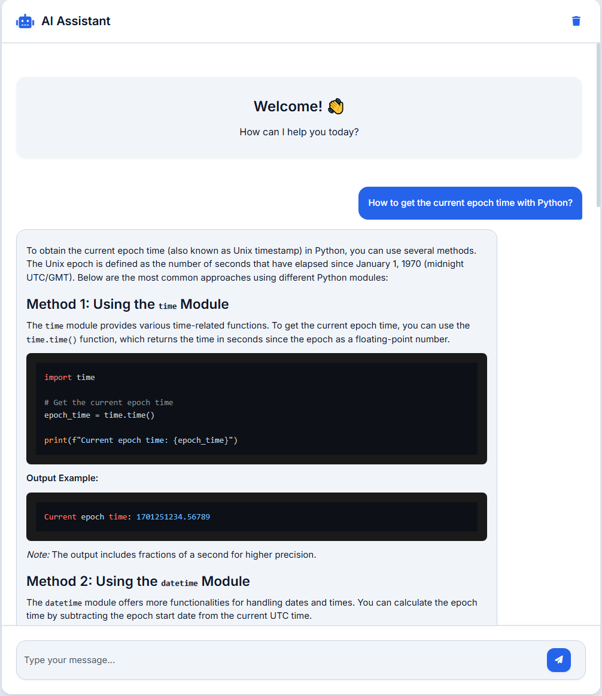

# AI Chat Assistant

A modern web-based chat interface for interacting with OpenAI's GPT model. This application provides a clean, professional interface for having conversations with AI.



## Features

- 🌐 Web-based interface
- 💬 Real-time chat interactions

## Prerequisites

Before running this project, make sure you have:

- Python 3.7+
- An OpenAI API key

## Installation

1. Install the required dependencies:
```bash
pip install -r requirements.txt
```

2. Add your OpenAI API key in .env file:
```env
OPENAI_API_KEY=your_openai_api_key_here
```

## Usage

1. Start the Flask server:
```bash
python chat_app.py
```

2. Open your web browser and navigate to:
```
http://localhost:5000
```

3. Start chatting with the AI assistant!

## Technologies Used

- Backend:
  - Flask (Python web framework)
  - OpenAI API (GPT model)
  - python-dotenv (Environment management)

- Frontend:
  - HTML5
  - CSS3
  - JavaScript
  - Marked.js (Markdown parsing)
  - Highlight.js (Code syntax highlighting)
  - Font Awesome (Icons)
  - Inter font family
